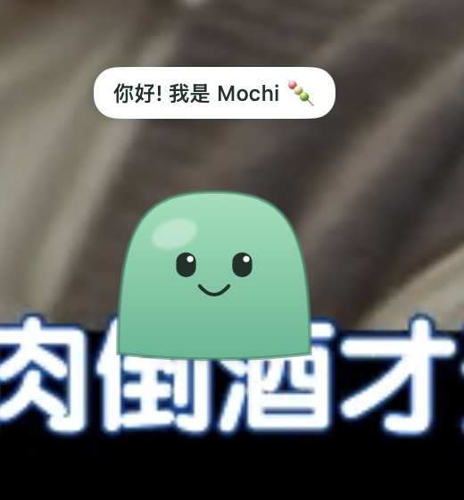

<div align="center">

# 🍡 Mochi — a tiny desktop pet for macOS

**A cute, code-drawn companion that lives on your desktop — and (soon) pairs with Claude Code & Codex.**



No image assets · No Xcode required · ~Native, a few MB of RAM

[Features](#features) · [Quick start](#quick-start) · [How it works](#how-it-works) · [Roadmap](#roadmap) · [中文](#中文简介)

</div>

---

## Features

- 🟢 **Lives on your desktop** — a borderless, transparent, always-on-top window that floats above your other apps without stealing focus.
- 😴 **Has a life of its own** — breathes, blinks, strolls around the screen, and naps.
- 🖱️ **Interactive** — drag Mochi anywhere; poke it and it reacts.
- 🎨 **Drawn entirely in code** — the character is pure SwiftUI vector shapes, so the whole app is a few MB and trivially restyleable. No sprite sheets to ship.
- 🧰 **Menu-bar controlled** — a 🍡 icon lets you poke it, put it to sleep, hide it, or quit.
- ⚙️ **No full Xcode needed** — builds with the Command Line Tools via a single `swiftc` invocation.

> **The bigger idea:** Mochi is being built to become the *face of your AI coding sessions* — reacting when Claude Code / Codex is thinking, notifying you when an agent finishes, and letting you talk to them through a speech bubble. See the [roadmap](#roadmap).

## Quick start

Requirements: macOS 13+ and the Xcode **Command Line Tools** (`xcode-select --install`). Full Xcode is *not* required.

```bash
git clone <your-fork-url> desk-pet
cd desk-pet
./run.sh           # builds (if needed) and launches Mochi
```

Look for the 🍡 icon in your menu bar. Mochi appears near the bottom of the screen your cursor is on.

To build without running:

```bash
./build.sh         # produces build/Mochi.app
open build/Mochi.app
```

To quit: use the menu-bar 🍡 → **退出 Mochi**, or `pkill -x Mochi`.

## Usage

| Action | How |
| --- | --- |
| Move Mochi | Click & drag it |
| Poke it | Click it once (or menu → 戳一下) |
| Sleep / wake | Menu → 睡觉 / 起床 (or poke a sleeping Mochi) |
| Hide / show | Menu → 隐藏 / 显示 |
| Quit | Menu → 退出 Mochi |

## How it works

Mochi uses the **AppKit** application lifecycle (not the SwiftUI `App` lifecycle) so it can own a borderless, non-activating, transparent floating panel — which is much easier in AppKit. The character itself is **SwiftUI**, hosted inside that panel.

```
Sources/
├── main.swift           # entry point — NSApplication + .accessory policy
├── AppDelegate.swift     # builds the window, hosts SwiftUI, status-bar menu
├── PetWindow.swift       # borderless NSPanel + mouse handling (drag / poke)
├── PetState.swift        # observable model the view renders from
├── PetController.swift    # the "brain": idle ↔ walk ↔ sleep state machine
└── PetView.swift         # the SwiftUI character (blob, face, expressions)
```

Design principles:

- **State is the single source of truth.** `PetController` mutates `PetState`; `PetView` is a pure function of it. Adding a behavior means adding a state + a way to render it.
- **No assets.** The blob, face, and bubble are vector shapes — change `Palette` in `PetView.swift` to reskin.
- **Interaction lives in AppKit.** `PetContainerView.hitTest` claims mouse events so SwiftUI never fights over them; clicks vs. drags are distinguished by movement.

## Roadmap

- [x] **P1 — Core pet:** floating window, breathing/blinking blob, drag, poke, menu bar.
- [ ] **P2 — More life:** follow-the-cursor mode, more idle animations, remember last position, multi-monitor polish.
- [ ] **P3 — Companion:** reminders (water / breaks / pomodoro / hourly chime) shown as speech bubbles + notifications.
- [ ] **P4 — AI pairing (the headline feature):**
  - Talk to Mochi via a small input; route to the `claude` / `codex` CLIs and show replies in the bubble.
  - React to live agent activity — "thinking" animation while an agent runs, a notification when it finishes.
- [ ] **Skinning:** swap the code-drawn character for custom sprites; a simple theme format.
- [ ] **Packaging:** signed/notarized release, Homebrew cask.

## Contributing

Issues and PRs welcome — see [CONTRIBUTING.md](CONTRIBUTING.md). Good first contributions: new idle animations, new expressions, a follow-cursor mode, or alternative characters/themes.

## License

[MIT](LICENSE) © 2026 yangran

---

## 中文简介

**Mochi 是一只用纯代码画出来的 macOS 桌面小宠物** —— 一个透明、置顶、不抢焦点的小浮窗，会呼吸、眨眼、在桌面上溜达、睡觉；你可以拖它、戳它，它会有反应。整只宠物是 SwiftUI 矢量图形，没有任何图片素材，所以体积极小、换皮极简单。

它的长期目标是成为**你 AI 编程会话的"具象化分身"**：当 Claude Code / Codex 在思考时它会有反应，跑完任务会提醒你，你还能通过头顶气泡直接跟它们对话（见上方 Roadmap 的 P4）。

**构建无需完整 Xcode**，只要 Command Line Tools：

```bash
./run.sh    # 构建并启动，菜单栏会出现 🍡 图标
```
