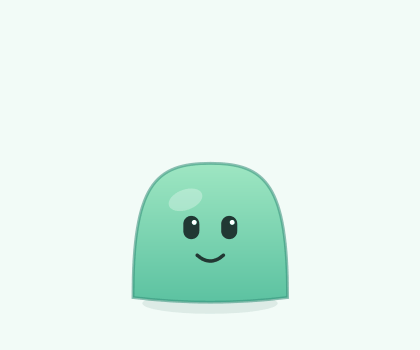
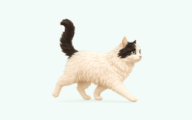
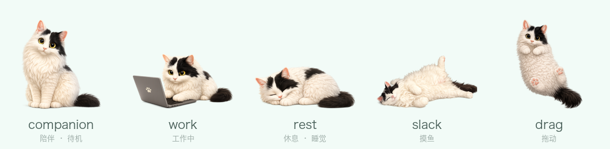

<div align="center">

# 🍡 Mochi — 桌面上的 AI 编程伙伴

**一只常驻 macOS 桌面的小宠物，实时映射你的 Claude Code / Codex 会话 —— 形象还能随你换。**




默认纯代码绘制 · 形象可更换 · 无需完整 Xcode · 原生、几 MB 内存

</div>

---

## 能做什么

- 🟢 **常驻桌面** —— 透明、置顶、不抢焦点的小浮窗，浮在其它窗口之上。
- 😴 **有自己的小生活** —— 会呼吸、眨眼、在桌面溜达、蹦跳、东张西望、打盹。
- 🖱️ **可交互** —— 拖动移动（位置会记住）；单击戳一下、双击开动作面板；**右键**开关「跟随鼠标」「睡觉 / 起床」。
- 🤖 **映射你的 AI 会话** —— 每个正在跑的 Claude Code / Codex 会话，在它头顶显示一个气泡（写着项目名 + 正在干什么）；**点气泡直接跳回那条会话**，跑完后气泡还会保留几分钟、仍可点。
- 📝 **快速备忘** —— 双击宠物弹出动作面板，直接打字回车存进 Apple 备忘录，或打开 Claude / Codex。
- 🎨 **形象可更换** —— 默认是纯代码画的薄荷史莱姆，也能换成**任意宠物 / 角色**（备好图就行，不限于猫）；菜单「形象…」打开选角面板，点缩略图就换；也能导入自己的图片，或用面板里的「复制生图 Prompt」让 AI 生成一套多状态形象（上图的猫，就是换过的自定义形象）。
- 🐈 **养一群猫** —— 一只当「主猫」映射 AI 会话，其余作为**氛围猫**在桌面溜达玩耍（最多 4 只）。内置 **杨百乐 + 杨十安** 两只示例，也能放自己的猫。
- ⚙️ **无需完整 Xcode** —— 只用 Command Line Tools，一条 `swiftc` 命令构建。

## 下载安装

到 [Releases](https://github.com/rrlan/mochi-pet/releases/latest) 下载 `Mochi-x.x.x.dmg`，打开后把 **Mochi** 拖进 **Applications**。通用版（Apple Silicon + Intel），需 **macOS 14+**。

> ⚠️ **首次打开**：这个 DMG 没做 Apple 公证，macOS 会先拦一下（「无法验证开发者」）。**右键点 Mochi → 打开 → 再点"打开"** 一次即可（或到 系统设置 → 隐私与安全性 → 点"仍要打开"）。之后正常双击启动。

菜单栏出现 🍡 就表示在跑了。

## 从源码构建

或者自己编 —— 只需 Xcode **Command Line Tools**（`xcode-select --install`），**不需要**完整 Xcode，macOS 14+：

```bash
git clone https://github.com/rrlan/mochi-pet.git desk-pet
cd desk-pet
./run.sh           # 构建（如需）并启动
```

菜单栏会出现 🍡 图标，Mochi 出现在你光标所在屏幕的底部附近。

只构建不运行：

```bash
./build.sh         # 产出 build/Mochi.app
open build/Mochi.app
```

退出：菜单栏 🍡 → **退出 Mochi**，或 `pkill -x Mochi`。

## 怎么用

**跟猫互动都在猫身上**（每只猫单独），菜单栏只管全局：

| 操作 | 方式 |
| --- | --- |
| 移动 | 拖动它（位置会记住） |
| 戳一下 | 单击它 |
| 动作面板（Claude / Codex / 备忘） | 双击它 |
| 跳回某个会话 | 点它头顶的会话气泡 |
| 跟随鼠标 · 睡觉 / 起床 | **右键**它（跟随时，屏幕任意处再右键即停） |
| 叫醒睡着的猫 | 双击它 |
| 换形象 · 选角 | 菜单 🍡 → **形象…** |
| 感知 AI 工作（开关） | 菜单 🍡 → 感知 AI 工作 |
| 隐藏 / 显示全部 | 菜单 🍡 → 隐藏 / 显示 |
| 退出 | 菜单 🍡 → 退出 Mochi |

备忘会追加到名为 `Mochi Memos` 的 Apple 备忘录笔记里。Mochi 不会把备忘内容发给任何 AI 服务。

## 换形象

Mochi 默认是纯代码绘制的薄荷史莱姆。你可以把它换成**任意形象** —— 不只是猫，狗、角色、随便什么宠物都行，**备好那几张图就成**（下面的猫只是示例）。换了之后，窗口、气泡、拖动、双击、AI 感知都不变。

<div align="center">

<br/><sub>自定义形象示例：换成一只猫，连走路逐帧动画都有 🐈</sub>
</div>

<div align="center">

<br/><sub>同一只猫的五个状态形象，外加走路逐帧（上面的 GIF）—— 一套形象包覆盖全部状态</sub>
</div>

> 🐈 **想直接用上面这只猫？** 它叫**杨百乐**（[@rrlan](https://github.com/rrlan) 的猫），还有它的搭档**杨十安**——两只都**随 App 内置**：🍡 → **形象…** 打开选角面板，点缩略图即换、点爪印让它出来逛，都含走路帧。整套图在 [`appearances/`](appearances/)，可拿去改成你自己的。

**五个静态槽位**（按当前状态切换），外加一个可选的走路逐帧动画 —— 各自的触发时机：

| 槽位 | 文件名关键词 | 什么时候显示 |
| --- | --- | --- |
| `companion` | `陪伴` / `默认` / `companion` / `idle` | **主形象**：待机（大部分时间）、被单击戳、以及走路时没提供走路帧 |
| `work` | `工作` / `忙` / `思考` / `work` / `busy` | 有 Claude Code / Codex 会话正在干活时，直到它安静下来 |
| `rest` | `休息` / `睡` / `rest` / `sleep` | 让它睡觉时（右键 → 让它睡觉），或长时间闲置自动打盹；双击叫醒 |
| `slack` | `摸鱼` / `发呆` / `slack` | 待机时随机进入的几秒「摸鱼」小歇 |
| `drag` | `拖动` / `站立` / `drag` | 正在拖动它的整个过程 |
| `walk/`（文件夹，逐帧） | 形象包里的 `walk/` 子文件夹 | 走路时循环播放：随机溜达，或开启「跟随鼠标」时 |

> 缺哪个槽位就**自动退回用 `companion`**，所以最少只画一张 `companion` 也能用。待机时的「蹦一下 / 东张西望」只是动画、不切形象；`work` 槽位仅由真实 agent 工作触发。

🍡 → **形象…** 打开**选角面板**，是一排缩略图 —— 「默认 Mochi」、内置的两只猫、以及你导入过的形象包，并排可选，互相切换不丢失上一个：

- **点缩略图** = 设为**主猫**；**点爪印** = 让这只**出来逛**（氛围猫）；右上角 **✕** = 删除。
- 底部两个按钮：**复制生图 Prompt**（拿去喂生图模型）、**打开文件夹**（直接看 `~/.mochi/packs/`）。
- 加新包（面板里的虚线格）：**导入文件夹**（选含 5 状态图 + 可选 `walk/` 的目录，含走路帧）、**图片做包**（选几张图，按文件名关键词匹配槽位，不含走路帧）。

每个形象包存成 `~/.mochi/packs/<名字>/` 一个文件夹，互不覆盖。

### 养一群猫 🐾

养了好几只？让它们一起上桌面 —— 主猫和氛围猫的分工：

- **主猫**（AI 化身）：感知 Claude / Codex 干活、头顶气泡、点气泡跳回会话、双击开动作面板；闲着也会自己溜达。
- **氛围猫**：纯陪玩 —— 随机溜达、休息、东张西望，可拖可戳，但不背任何 AI 语义。最多 **4 只**。
- 角色二选一：把氛围猫点成主猫，它就去接活、不再多一只在逛。
- 每只猫一个独立的透明小窗口；只有主猫感知 AI 工作。

**自己做一套形象**：最省事是面板里的 **复制生图 Prompt** —— 拿一张宠物 / 角色的照片 + 这段 prompt 喂给生图模型（皮克斯风、透明背景、5 个状态 + 走路帧），出图后命名 `companion/work/rest/slack/drag.png` 放进一个文件夹，**导入文件夹** 即可。

进阶（脚本批量生成，需本地 Codex 图像 CLI + `OPENAI_API_KEY`）：

```bash
./tools/generate_appearance_pack.py --image cat-1.png --image cat-2.png --install
```

生成 `companion/work/rest/slack/drag.png` 装到 `~/.mochi/appearances/`，下次启动自动收进形象库。

## 联动 Claude Code / Codex

Mochi 会对你的 AI 编程会话做出反应：有 agent 在跑时显示忙碌气泡，跑完弹通知。

> **目前主要支持桌面 App**（Claude Code 桌面 / Codex App）：**点气泡跳转**和**替你点「允许」**都是跳进桌面 App 操作的。终端 CLI 里跑的会话也能被**感知**（照样显示气泡、弹通知），但点击会把你带进桌面 App、且「允许」按键到不了终端——**终端 CLI 的原生支持还在计划中**。

### 自动（推荐）—— 桌面版也支持

Mochi **自动监听** agent 写的会话 transcript 文件，无需任何配置：

- Claude Code → `~/.claude/projects/**/*.jsonl`
- Codex → `~/.codex/sessions/**/*.jsonl`

文件在增长 = 该 agent 正在这一轮；安静下来 = 这一轮结束。这是**唯一**能覆盖所有形态的方式 —— CLI、ACP、以及**桌面版（Claude Code desktop、Codex App）**，后者不触发 shell hooks。

气泡按会话显示，写着**任务首句**（该会话的第一条提示词，便于区分同目录跑的多个会话；取不到时退回项目名）+ 颜色圆点（🟠 Claude，🔵 Codex）+ 正在干什么，例如 `整体review代码 · 运行 swift build`。**点气泡跳回那条会话**（`claude://resume` / `codex://threads`）；跑完后气泡保留几分钟、仍可点。Claude 和 Codex 分开计数，两个一起跑时各显示一个气泡，直到都结束。

菜单开关：**感知 AI 工作**。注意：Claude Code 的*沙箱* Cowork 模式可能把 transcript 写在沙箱内、`~/.claude/projects` 之外，那种情况从外部检测不到。

### 手动 / 显式（`mochi` CLI + hooks）

也可以显式驱动。`mochi` CLI（在 `bin/`）写事件，Mochi 读。先把它放到 `PATH`：

```bash
ln -sf "$PWD/bin/mochi" /usr/local/bin/mochi
```

```bash
mochi busy claude          # 某来源开始工作
mochi done claude          # 某来源结束 → 通知
mochi say "构建通过了"      # 让它说一句
mochi alert "需要 review"  # 警告 + 通知
```

接进 Claude Code（`~/.claude/settings.json`）：

```json
{
  "hooks": {
    "UserPromptSubmit": [{ "hooks": [{ "type": "command", "command": "mochi busy claude" }] }],
    "Stop":             [{ "hooks": [{ "type": "command", "command": "mochi done claude" }] }]
  }
}
```

接进 Codex（`~/.codex/config.toml`）：

```toml
notify = ["mochi", "done", "codex"]
```

> 用了显式 hooks，就把对应工具的**自动监听关掉**（菜单 → 感知 AI 工作），否则会重复触发。

## 工作原理

Mochi 用 **AppKit** 的应用生命周期（不是 SwiftUI 的 `App`）来掌控一个无边框、不激活、透明的浮动面板；宠物形象本身是 **SwiftUI**，host 在这个面板里。状态是单一事实源：`PetController` 改 `PetState`，`PetView` 是它的纯函数；默认形象、脸、气泡都是矢量图形，自定义形象包是 app 外的可选用户数据。

## License

[MIT](LICENSE) © 2026 rrlan
